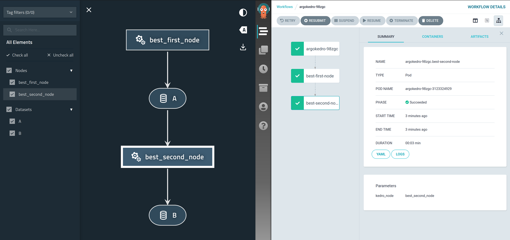

==========
Kedro-Argo
==========

.. start-badges

.. list-table::
    :stub-columns: 1

    * - docs
      - |docs|
    * - tests
      - | |travis| |appveyor| |requires|
        | |codecov|
    * - package
      - | |version| |wheel| |supported-versions| |supported-implementations|
        | |commits-since|
.. |docs| image:: https://readthedocs.org/projects/kedro-argo/badge/?style=flat
    :target: https://readthedocs.org/projects/kedro-argo
    :alt: Documentation Status

.. |travis| image:: https://api.travis-ci.org/nraw/kedro-argo.svg?branch=master
    :alt: Travis-CI Build Status
    :target: https://travis-ci.org/nraw/kedro-argo

.. |appveyor| image:: https://ci.appveyor.com/api/projects/status/github/nraw/kedro-argo?branch=master&svg=true
    :alt: AppVeyor Build Status
    :target: https://ci.appveyor.com/project/nraw/kedro-argo

.. |requires| image:: https://requires.io/github/nraw/kedro-argo/requirements.svg?branch=master
    :alt: Requirements Status
    :target: https://requires.io/github/nraw/kedro-argo/requirements/?branch=master

.. |codecov| image:: https://codecov.io/github/nraw/kedro-argo/coverage.svg?branch=master
    :alt: Coverage Status
    :target: https://codecov.io/github/nraw/kedro-argo

.. |version| image:: https://img.shields.io/pypi/v/kedro-argo.svg
    :alt: PyPI Package latest release
    :target: https://pypi.org/project/kedro-argo

.. |wheel| image:: https://img.shields.io/pypi/wheel/kedro-argo.svg
    :alt: PyPI Wheel
    :target: https://pypi.org/project/kedro-argo

.. |supported-versions| image:: https://img.shields.io/pypi/pyversions/kedro-argo.svg
    :alt: Supported versions
    :target: https://pypi.org/project/kedro-argo

.. |supported-implementations| image:: https://img.shields.io/pypi/implementation/kedro-argo.svg
    :alt: Supported implementations
    :target: https://pypi.org/project/kedro-argo

.. |commits-since| image:: https://img.shields.io/github/commits-since/nraw/kedro-argo/v0.0.9.svg
    :alt: Commits since latest release
    :target: https://github.com/nraw/kedro-argo/compare/v0.0.9...master

.. end-badges

Converting kedro pipelines to argo pipelines.

* Free software: BSD 3-Clause License

Installation
============

::

    pip install kedro-argo

You can also install the in-development version with::

    pip install https://github.com/nraw/kedro-argo/archive/master.zip

Requirements
============

- To be used with Kedro, so it's assumed this package is used with a Kedro project.

- Argo CLI is needed for the deployment step. It's also assumed that Argo is already installed on your kuberentes instance.

- You must specify an image name as a parameter. You can generate the image using Kedro-docker.

- As the workflow will be in Argo, which means every step will run in its own container. Therefore, all datasets should be somehow passed between containers or else the pipeline will fail. This means either all datasets should be saved externally (S3, Azure, etc.) or in a shared folder that your deployment would have access to.

Usage
============

When installed, argo should be visible under your kedro commands, if you're in a kedro project
::

    kedro

Then you have two options for obtaining the yaml file, namely via Helm or via ytt.

Helm
----

:: 

   kedro argo IMAGE_NAME

Add this repository to your helm charts:
::

   helm repo add kedro-argo https://nraw.github.io/kedro-argo-helm/

Then either directly install it by passing the kedro.yaml for input values
::

   helm install -f templates/kedro.yaml kedro-argo kedro-argo/kedro-argo

Or clone it to your repository and change anything that you would still need:
::

   helm pull kedro-argo/kedro-argo --untar

ytt
---

Get the kedro.yaml file by running
::

   kedro argo --ytt IMAGE_NAME

You can now run:
::

   ytt -f templates > argo.yaml

or if you prefer in Docker:
::

   docker run --rm -it --name ytt -v $(pwd)/templates:/templates gerritk/ytt:latest -f /templates > argo.yaml

and finally
::

   argo submit --watch argo.yaml

Documentation
=============

https://kedro-argo.readthedocs.io/

Development
===========

To run the all tests run::

    tox

Note, to combine the coverage data from all the tox environments run:

.. list-table::
    :widths: 10 90
    :stub-columns: 1

    - - Windows
      - ::

            set PYTEST_ADDOPTS=--cov-append
            tox

    - - Other
      - ::

            PYTEST_ADDOPTS=--cov-append tox
